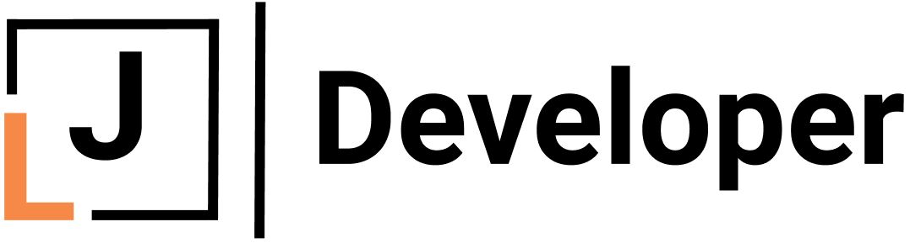

# jing-portfolio

## GitHub link 
  [https://github.com/jliclaire/jing-portfolio]

## portfolio website - Netlify link
  https://happy-chandrasekhar-3b32d9.netlify.com/

## Description of the portfolio website
  ####Purpose

    The purpose of this project is to use HTML and CSS to create my personal portfolio website to show my experience and skills.

  #### Functionality / features

    The website includes functions such as a navigation menu fixed on top of the page, A gallery of projects that I have completed and a contact form.

  * Sitemap
    It is a one page scrolled down website including five pages of home, about, skill, work and contact.

  * Screenshots

    (./css/img/logo.JPG)

  -Target audience

    The target audience of this site is potential empolyeers.

  -Tech stack (e.g. html, css, deployment platform, etc)
  
    The site structure was written used HTML, styled by CSS, deployed on Netlify.

## Design documentation
-Design process
  color and font selection: 
  
-Wireframes
  
-Personal logo (optional)
-Usability considerations
  The site is responsive for different screen size, laptop, tablet and mobile

## Planning process
-Project plan & timeline
-Screenshots of Trello board(s)

## Short Answer
-Describe key events in the development of the internet from the 1980s to today (max. 150 words)

-Define and describes the relationship between fundamental aspects of the internet such as: domains, web servers, DNS, and web browsers (max. 150 words)

-Reflect on one aspect of the development of internet technologies and how it has contributed to the world today (max. 150 words)