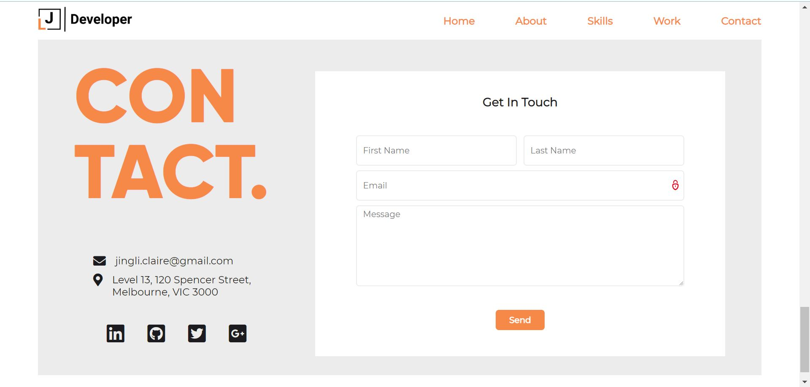

# jing-portfolio

## GitHub link

https://github.com/jliclaire/jing-portfolio

## portfolio website - Netlify link

https://happy-chandrasekhar-3b32d9.netlify.com/

## Description of the portfolio website

- Purpose

  The purpose of this project is to use HTML and CSS to create my personal portfolio website to show my experience and skills.

- Functionality / features

  The website includes functions such as a navigation menu fixed on top of the page and a contact form. A feature of a project portfolio gallery.

- Sitemap

  A single page scrolling website including five sections: home, about, skill, work and contact.

- Screenshots

  
  
  
  
  
  

- Tech stack

  The site structure was written used HTML, styled by CSS, deployed on Netlify.
