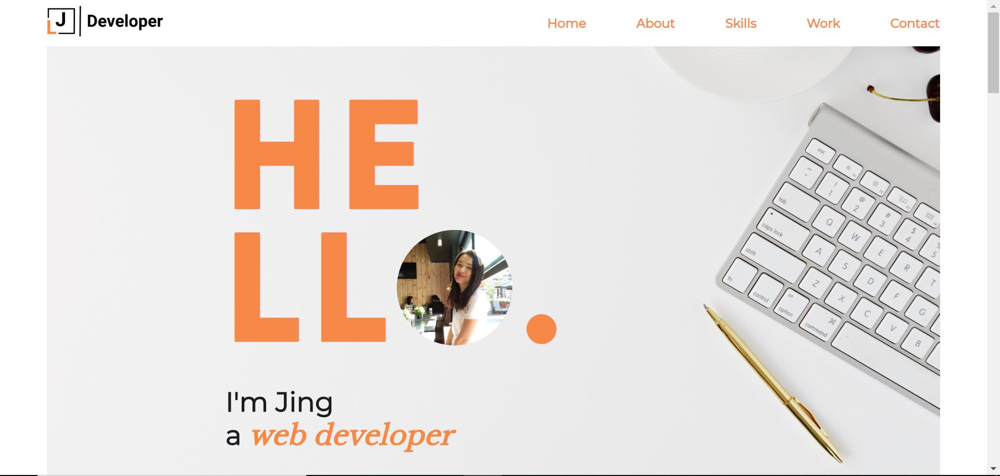
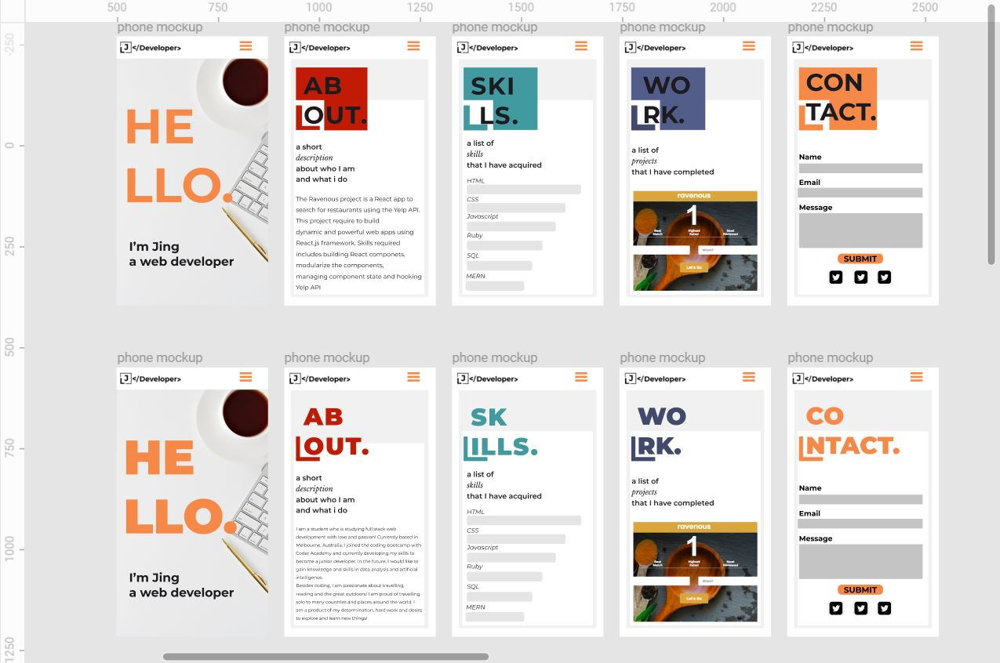
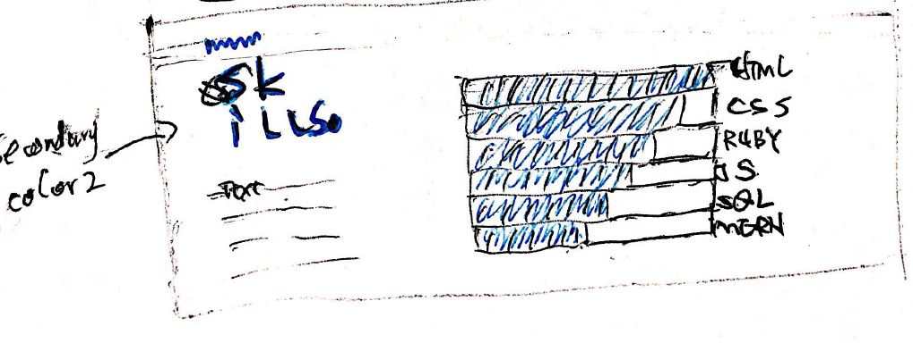

# jing-portfolio

## GitHub link 
  https://github.com/jliclaire/jing-portfolio

## portfolio website - Netlify link
  https://happy-chandrasekhar-3b32d9.netlify.com/

## Description of the portfolio website
  * Purpose

    The purpose of this project is to use HTML and CSS to create my personal portfolio website to show my experience and skills.

  * Functionality / features

    The website includes functions such as a navigation menu fixed on top of the page and a contact form. A feature of a project portfolio gallery.

  * Sitemap

    A single page scrolling website including five sections: home, about, skill, work and contact.

  * Screenshots

    
    
    
    
    
    

  * Target audience

    The target audience of this site is potential empolyeers.

  * Tech stack 
  
    The site structure was written used HTML, styled by CSS, deployed on Netlify.

## Design documentation
  * Design process

    * color and font selection: 

      
      

    * changes in design

      
      
      

  * Wireframes

    
    
    
    
    

  * Personal logo

    

  * Usability considerations

    The site is responsive for different screen size, laptop, tablet and mobile

## Planning process

  * Project plan & timeline

      Day1(Tue) - Brainstoming(style, color, font, image) sketch and mockup

      Day2(Wed) - created all files that needed, link files, set up global css style, create fixed nav bar, pages for home, about and work

      Day3(Thu) - created pages for skills, contact and footer

      Day4(Fri) - make the website responsive to different screen size

      Day6(Sat) - finalised the design

  * Screenshots of Trello board(s)
  
      
      
      
      
      
      
      
      
      
      
      
      

## Short Answer
-Describe key events in the development of the internet from the 1980s to today (max. 150 words)

-Define and describes the relationship between fundamental aspects of the internet such as: domains, web servers, DNS, and web browsers (max. 150 words)

-Reflect on one aspect of the development of internet technologies and how it has contributed to the world today (max. 150 words)