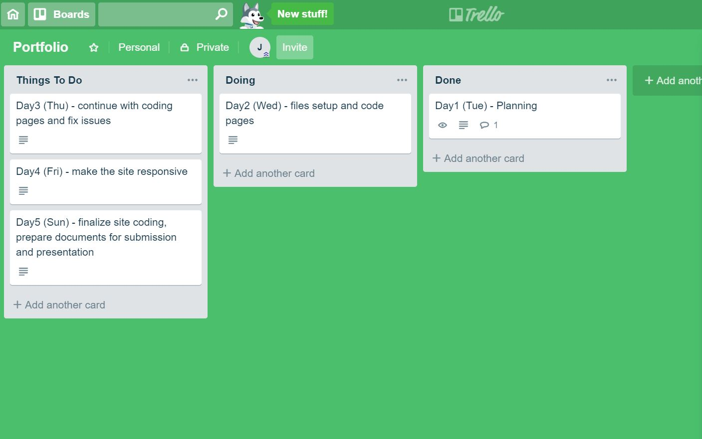

# jing-portfolio

## GitHub link 
  https://github.com/jliclaire/jing-portfolio

## portfolio website - Netlify link
  https://happy-chandrasekhar-3b32d9.netlify.com/

## Description of the portfolio website
  * Purpose

    The purpose of this project is to use HTML and CSS to create my personal portfolio website to show my experience and skills.

  * Functionality / features

    The website includes functions such as a navigation menu fixed on top of the page and a contact form. A feature of a project portfolio gallery.

  * Sitemap

    A single page scrolling website including five sections: home, about, skill, work and contact.

  * Screenshots

    
    
    
    
    
    

  * Target audience

    The target audience of this site is potential empolyeers.

  * Tech stack 
  
    The site structure was written used HTML, styled by CSS, deployed on Netlify.

## Design documentation
  * Design process

    * color and font selection: 

      
      

    * changes in design

      
      
      

  * Wireframes

    
    
    
    
    

  * Personal logo

    

  * Usability considerations

    The site is responsive for different screen size, laptop, tablet and mobile

## Planning process

  * Project plan & timeline

      Day1(Tue) - Brainstoming(style, color, font, image) sketch and mockup

      Day2(Wed) - created all files that needed, link files, set up global css style, create fixed nav bar, pages for home, about and work

      Day3(Thu) - created pages for skills, contact and footer

      Day4(Fri) - make the website responsive to different screen size

      Day6(Sat) - finalised the design

  * Screenshots of Trello board(s)
  
      
      
      
      
      
      
      
      
      
      
      
      

## Short Answer
#### Describe key events in the development of the internet from the 1980s to today 

  Internet was initially used by the government and government bodies. commercial use of Internet was forbidden however by 1990, several ISP companies are providing Internet access to commercial customers.

  The World Wide Web was invented in 1989 by Tim Berners-Lee. It enabled documents are other web resources to interlinked by hypertext links and can be accessed via the Internet by using a web browser and web-based applications. 

  From 1990s to early 2000s, Web1.0 was widly used. It was static and lacked widespread social engagement.

  Web2.0 starting around 2004 has brought the users to interact with the website. The way websites are made and used has been changed from users passively viewing web contents to users create their own contents.

  Sooner after the introduction of Web2.0, mobile devices have become the development of internet “on the move”. People are using mobile phones to access internet everyday and everywhere when there is a connection. 

#### Define and describes the relationship between fundamental aspects of the internet such as: domains, web servers, DNS, and web browsers 

  A domain name is the location of a website in a human-friendly read form. Each domain name is connected to a unique IP address.

  A web server is a computer stores web server software and a website's component files. 

  A web browser is a software program that accessing sites or information on a network.

  DNS is short for Domain Name System which is the phonebook of the Internet. It can transfer domain name to IP address, so that the browsers can load resources from that address. 

  A user types the domain name in the address bar of a browser to request a specific website. DNS transfers that domain name to IP address so that the browser knows which web server it needs to obtain the page from. Once the browser reaches this web server, it retrieves, interprets, and renders the page in the main window for the user to view.

#### Reflect on one aspect of the development of internet technologies and how it has contributed to the world today 

  One aspect of the development of Internet technologies is the development of using mobile devices to access the Internet. This enables people to have the Internet connection for information and communication when they are not around with a personal computer. The use of Internet became more flexible and accessible. 

  The Wireless Application Protocol (WAP) was created as the networking model for mobile phones. The induction of mobile operating system Android and iOS enables applications specifically designed for mobile phones to be used by the users. Websites are now more mobile targeted with the induction of responsive design. 

  Nowadays people are mainly using smart phones to access the Internet for navigation, news, games, and socialising. The Internet can now be access everywhere on the move.

  